# BrainSurgery Codebase Reference

This document is a practical map of the `brainsurgery` codebase: core classes, execution processes, and where each major responsibility lives.

## 1. High-level architecture

`brainsurgery` is organized around four core layers:

1. `core/`: runtime abstractions, type contracts, expression/regex/structured matching, and transform registry.
2. `transforms/` + `expressions/`: concrete operations that compile payloads and execute against model state dicts.
3. `engine/`: plan compilation/execution orchestration, checkpoint IO, providers (in-memory and arena-backed), output/summaries, and runtime flags.
4. `cli/` + `web/`: user-facing interfaces (CLI, interactive prompt, webcli API/UI, web UI API/UI).

Everything eventually runs through:

1. `compile_plan(...)` -> parsed `SurgeryPlan`
2. `create_state_dict_provider(...)` -> lazy model loading backend
3. `SurgeryPlan.execute_pending(...)` -> ordered transform execution
4. optional `save_output(...)` -> checkpoint persistence

## 1.1 Class diagram

Source file: `class_diagram.mermaid`

```mermaid
classDiagram
direction LR

class SurgeryPlan {
  +inputs: Dict[str, Path]
  +output: _OutputSpec?
  +steps: List~PlanStep~
  +raw_inputs: Any
  +raw_output: Any
  +compile_pending(...)
  +execute_pending(...)
  +to_raw_plan(...)
}

class PlanStep {
  +raw: dict
  +compiled: CompiledTransform?
  +status: pending|running|done|failed
  +error: str?
}

class _OutputSpec {
  +path: Path
  +format: safetensors|torch|dcp?
  +shard: str?
}

class CompiledTransform {
  +transform: BaseTransform
  +spec: object
}

class BaseTransform {
  <<abstract>>
  +compile(payload, default_model)
  +apply(spec, provider)
  +_infer_output_model(spec)
}

class TypedTransform~SpecT~ {
  <<abstract>>
  +spec_type: type
  +require_spec(spec) SpecT
}

class IteratingTransform~SpecT,ItemT~ {
  <<abstract>>
  +resolve_items(spec, provider) List~ItemT~
  +validate_resolved_items(spec, items, provider)
  +apply_item(spec, item, provider)
}

class UnaryTransform~UnarySpecT~ {
  +compile(...)
  +resolve_items(...) List~str~
  +apply_to_target(spec, name, provider)
}

class BinaryMappingTransform~BinarySpecT~ {
  +compile(...)
  +resolve_items(...) List~(src_name,dst_name)~
  +apply_mapping(spec, src_name, dst_name, provider)
}

class TernaryMappingTransform~TernarySpecT~ {
  +compile(...)
  +resolve_items(...) List~(src_a_name,src_b_name,dst_name)~
  +apply_mapping(spec, src_a_name, src_b_name, dst_name, provider)
}

class UnarySpec {
  +target_ref: TensorRef
  +collect_models()
}

class BinaryMappingSpec {
  +from_ref: TensorRef
  +to_ref: TensorRef
  +collect_models()
}

class TernaryMappingSpec {
  +from_a_ref: TensorRef
  +from_b_ref: TensorRef
  +to_ref: TensorRef
  +collect_models()
}

class TensorRef {
  +model: str?
  +expr: str|list
  +slice_spec: str?
}

class DeclarativeUnaryTransform~UnarySpecT~
class DeclarativeBinaryTransform~BinarySpecT~
class DeclarativeTernaryTransform~TernarySpecT~
class UnaryRefs { +target_slice: bool }
class BinaryRefs { +from_slice: bool +to_slice: bool }
class TernaryRefs { +from_a_slice: bool +from_b_slice: bool +to_slice: bool }

SurgeryPlan "1" o-- "*" PlanStep
SurgeryPlan "1" o-- "0..1" _OutputSpec
PlanStep "0..1" --> CompiledTransform
CompiledTransform --> BaseTransform

BaseTransform <|-- TypedTransform
TypedTransform <|-- IteratingTransform
IteratingTransform <|-- UnaryTransform
IteratingTransform <|-- BinaryMappingTransform
IteratingTransform <|-- TernaryMappingTransform

UnaryTransform --> UnarySpec
BinaryMappingTransform --> BinaryMappingSpec
TernaryMappingTransform --> TernaryMappingSpec

UnarySpec --> TensorRef
BinaryMappingSpec --> TensorRef
TernaryMappingSpec --> TensorRef

UnaryTransform <|-- DeclarativeUnaryTransform
BinaryMappingTransform <|-- DeclarativeBinaryTransform
TernaryMappingTransform <|-- DeclarativeTernaryTransform

DeclarativeUnaryTransform --> UnaryRefs
DeclarativeBinaryTransform --> BinaryRefs
DeclarativeTernaryTransform --> TernaryRefs
```

## 2. Package map

### Top-level package (`brainsurgery/`)

- `__init__.py`
  - Main Typer entrypoint.
  - Exposes `brainsurgery cli`, `brainsurgery webcli`, and `brainsurgery webui`.
  - Normalizes option/argument ordering for default `cli` invocation.

### Core runtime and contracts (`brainsurgery/core/`)

- `core/specs/`
  - `types.py`: `StateDictLike`, `StateDictProvider`, `TransformError`.
  - `refs.py`: `TensorRef`, model/expression/slice parsing.
  - `validation.py`: payload key checks, numeric/type helpers, dtype parsing.
- `core/runtime/transform.py`
  - Transform base classes (`BaseTransform`, `TypedTransform`, `UnaryTransform`, `BinaryMappingTransform`, `TernaryMappingTransform`).
  - Global transform registry (`REGISTRY`, `register_transform`, `get_transform`).
  - `TransformControl` for orderly `exit`.
- `core/runtime/declarative.py`
  - Declarative transform wrappers (`DeclarativeUnaryTransform`, `DeclarativeBinaryTransform`, `DeclarativeTernaryTransform`).
  - Shared docs/slice-policy mechanics used by most transforms.
- `core/compile/`
  - `matching.py`: structured path matcher (`$x`, `*xs`, `~regex` semantics).
  - `name_mapping.py`: resolves source/destination mappings for regex and structured patterns.
  - `resolver.py`: tensor/materialized resolution helpers used by asserts/transforms.
  - `expression.py`: assert expression registry (`register_assert_expr`, `compile_assert_expr`).
- `core/completion.py`
  - Filesystem path completion helper.

### Orchestration and storage (`brainsurgery/engine/`)

- `plan.py`
  - `SurgeryPlan`, `PlanStep`, `_OutputSpec`.
  - Parsing and compile-time validation (`parse_inputs`, `parse_transform_entry`, alias checks).
- `execution.py`
  - Ordered transform execution loop with interactive vs non-interactive failure behavior.
- `providers.py`
  - `BaseStateDictProvider`, `InMemoryStateDictProvider`, `ArenaStateDictProvider`.
  - Lazy model opening and output save delegation.
- `state_dicts.py`
  - `SlotBackedStateDict` abstraction plus concrete `_InMemoryStateDict` and `_ArenaStateDict`.
  - Tensor read/write access counting and dry-run overlays.
- `arena.py`
  - File-backed segmented tensor storage used by arena provider.
- `checkpoint_io.py`
  - Read/write checkpoint formats, shard save/load orchestration, threadpool IO.
- `output_paths.py` / `output_model.py`
  - Output format/path/shard resolution and output-model inference.
- `summary.py`
  - Executed-plan summary generation (`raw` and `resolve` modes).
- `flags.py`
  - Session runtime flags: `dry_run`, `verbose`.
- `provider_utils.py`
  - Alias introspection/edit helpers used by transforms/UI.

### Operations (`brainsurgery/transforms/`)

- Modules auto-import at package import time; each module calls `register_transform(...)`.
- Operation set spans:
  - utility/control (`help`, `prefixes`, `set`, `exit`, `dump`, `diff`, `assert`)
  - IO (`load`, `save`, `execute`)
  - mapping/data movement (`copy`, `move`, `delete`, `assign`, `split`, `concat`)
  - math and shape ops (`add`, `subtract`, `multiply`, `matmul`, `scale`, `cast`, `reshape`, `permute`, `clamp`, `fill`)
  - in-place variants (`add_`, `subtract_`, `scale_`, `cast_`, `reshape_`, `clamp_`, `fill_`, `phlora_`)
  - initialization ops (`zeroes`, `ones`, `rand`)
  - low-rank ops (`phlora`)
  - batch plan execution (`execute` can run nested transform lists/plans; nested `inputs` become `load` and nested `output` becomes `save`)

### Assertions (`brainsurgery/expressions/`)

- Expression modules auto-register via `@register_assert_expr(...)`.
- Supported operators:
  - `exists`, `count`, `shape`, `dimensions`, `dtype`, `equal`, `iszero`
  - access-count expressions: `reads`, `writes`
  - combinators: `all`, `any`, `not`

### User interfaces

- `brainsurgery/cli/`
  - CLI command (`cli.py`), config merge/overrides (`config.py`), interactive prompt (`interactive.py`), OLY parser (`oly.py`), tab completion (`complete.py`), summary writing.
- `brainsurgery/web/cli/`
  - lightweight web front-end for one-shot plan execution (`/api/run`).
- `brainsurgery/web/ui/`
  - session-driven interactive browser UI, transform metadata endpoints, progress polling, model inspection dumps, upload/load/save APIs.

### IO adapters (`brainsurgery/io/`)

- format-specific checkpoint/tensor adapters for:
  - `safetensors`
  - `torch` (`.pt`, `.pth`, `.bin`)
  - `numpy` tensor files (`.npy`, `.npz`)
  - torch distributed checkpoint (DCP) directories

## 3. Core classes and interfaces

## 3.1 Transform runtime classes

- `BaseTransform` (`core/runtime/transform.py`)
  - Contract: `compile(payload, default_model)`, `apply(spec, provider)`, `_infer_output_model(spec)`.
  - Completion hooks for interactive UX.
- `TypedTransform[SpecT]`
  - Adds type-checked `require_spec(...)` and `spec_type`.
- `IteratingTransform[SpecT, ItemT]`
  - Shared apply loop with item resolution and optional progress callbacks.
- `UnaryTransform` / `BinaryMappingTransform` / `TernaryMappingTransform`
  - Standardized parsing, model inference, mapping validation, and item dispatch.
- Declarative wrappers in `core/runtime/declarative.py`
  - Reduce boilerplate for common unary/binary/ternary transform patterns.

## 3.2 Plan classes

- `SurgeryPlan` (`engine/plan.py`)
  - Holds `inputs`, optional `output`, and ordered `PlanStep`s.
  - Methods:
    - `compile_pending(...)`: compile raw transform steps and validate model alias references.
    - `execute_pending(...)`: execute only pending compiled steps and update per-step status.
    - `to_raw_plan(executed_only=...)`: serialize raw/or executed transforms.
- `PlanStep`
  - Keeps raw transform payload, compiled transform, run status, and optional error text.

## 3.3 Provider and state-dict interfaces

- `StateDictLike` protocol (`core/specs/types.py`)
  - Mutable mapping of tensor names to `torch.Tensor`.
  - Adds slot semantics and access counting.
- `StateDictProvider` protocol
  - Minimal contract: `get_state_dict(model_alias)`.
- `BaseStateDictProvider` (`engine/providers.py`)
  - Common lazy-loading logic and output save path.
- `InMemoryStateDictProvider`
  - Stores tensors directly in RAM.
- `ArenaStateDictProvider`
  - Stores tensor slots in segmented file-backed arena.
- `SlotBackedStateDict` + concrete implementations
  - Shared behavior:
    - dry-run overlay state
    - access count tracking (`reads`, `writes`)
    - slot-based binding for efficient move/copy behavior

## 3.4 Reference and matching classes

- `TensorRef` (`core/specs/refs.py`)
  - `model` + expression (`regex string` or structured token list) + optional `slice_spec`.
- `ResolvedMapping` (`core/compile/name_mapping.py`)
  - Resolved src/dst model/name/slice tuple produced by mapping resolver.
- `_StructuredPathMatcher` (`core/compile/matching.py`)
  - Implements structured match/rewrite DSL used by list-form expressions.

## 3.5 Expression interfaces

- `Expression` protocol (`core/compile/expression.py`)
  - `evaluate(provider)` and `collect_models()`.
- `ExpressionHelp`
  - Metadata used by `help` and UI to render per-expression payload requirements.

## 4. Execution processes

## 4.1 Batch CLI execution process

From `brainsurgery/cli/cli.py`:

1. Parse config items (YAML fragments + `key=value` overrides).
2. Normalize raw plan (`engine.normalize_raw_plan`).
3. Compile plan (`engine.compile_plan`).
4. Create provider (`inmemory` or `arena`).
5. Execute pending transforms in order (`interactive=False`).
6. Optionally run interactive post-pass (`-i`).
7. If output configured and not dry-run: save output checkpoint.
8. Optionally emit executed-plan summary.
9. Close provider.

Failure model:

- Batch mode: transform errors raise and abort.
- Interactive mode: submitted block stops on first error and returns control to prompt.

## 4.2 Transform execution process

For each compiled step:

1. `transform.apply(spec, provider)` executes.
2. Iterating transforms resolve target/mapping items first.
3. `validate_resolved_items(...)` enforces destination existence policy.
4. `apply_item(...)` mutates state dict(s) per item.
5. `TransformResult` records operation name/count and optional control (`EXIT`).
6. `SurgeryPlan` marks step `done`/`failed` and keeps raw transform in executed summary.

## 4.3 Model alias and output model process

- During compile, each transform spec must expose `collect_models()` for alias validation.
- As transforms compile, inferred output aliases are added to `known_models`.
- Final output model is inferred from executed plan via `engine/output_model.py`.
- Utility transforms that do not produce model tensors override `contributes_output_model(...)` or raise on `_infer_output_model(...)`.

## 4.4 Checkpoint IO process

Loading:

1. Provider lazily opens model path on first alias access.
2. Directory loading supports torch files, safetensors (with optional index), and DCP layouts.
3. Multi-file loads run via threadpool helper with progress.

Saving:

1. Resolve output destination and format (`safetensors`, `torch`, `dcp`).
2. If safetensors with shard size, split tensor map and write shards in parallel.
3. Write index file for sharded safetensors (`model.safetensors.index.json`).

## 4.5 Runtime flag process

- `set` transform updates runtime flags:
  - `dry_run`: provider/state dict logic uses overlays and bypasses persistent writes.
  - `preview`: emits impact summaries for changed/created/deleted refs; interactive mode asks go/no-go before tensor-impacting apply.
  - `verbose`: transform helper emitters can print richer activity lines.
- CLI/webcli reset flags at run start.
- WebUI resets flags at session start and then preserves them across transforms in that session.

## 5. Interfaces and extension points inside code

## 5.1 Transform extension interface

To add a transform:

1. Implement a new class extending `TypedTransform` or declarative/runtime base variants.
2. Define compile-time payload validation and spec dataclass.
3. Implement apply behavior against `StateDictProvider`.
4. Register with `register_transform(...)`.
5. Expose help text/completion hints for interactive/web UX.
6. Add tests in `tests/transforms/` and cross-feature tests where relevant.

## 5.2 Assert expression extension interface

To add an assert operator:

1. Implement expression dataclass with `evaluate(...)` and `collect_models()`.
2. Add compiler function with payload validation.
3. Decorate with `@register_assert_expr(...)` including help metadata.
4. Add tests under `tests/expressions/`.

## 5.3 Provider extension interface

To add a new backend provider:

1. Implement `StateDictLike` behavior (tensor mapping + slot/access semantics).
2. Implement provider class with lazy load + create + close behavior.
3. Integrate into `create_state_dict_provider(...)`.
4. Ensure IO/save behavior and alias utilities remain compatible.

## 6. Reference docs map

- Main interface guide: `docs/interfaces-reference.md`
- OLY specs:
  - `docs/oly-spec.md`
  - `docs/oly-yaml-grammar.md`
  - `docs/oly-conformance.md`
- Class diagram source: `class_diagram.mermaid`

## 7. Test suite layout (for maintainers)

- `tests/transforms/`: per-transform behavior and edge cases.
- `tests/expressions/`: assert operator semantics.
- `tests/test_cli.py`, `test_interactive.py`, `test_completion.py`: CLI and interactive UX.
- `tests/test_webcli_*`, `tests/test_webui_*`: web API/UI backend behavior.
- `tests/test_engine_*`, `test_plan*`, `test_provider*`, `test_io.py`: orchestration and storage.

This structure matches the architecture boundaries above and is a good starting point for regression-focused changes.
